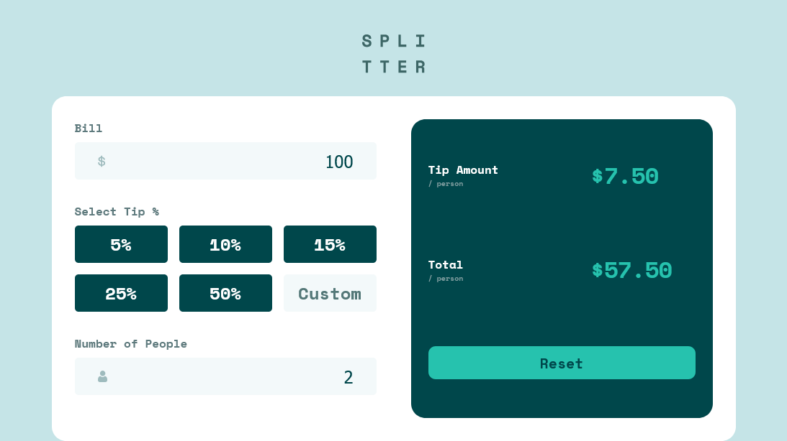
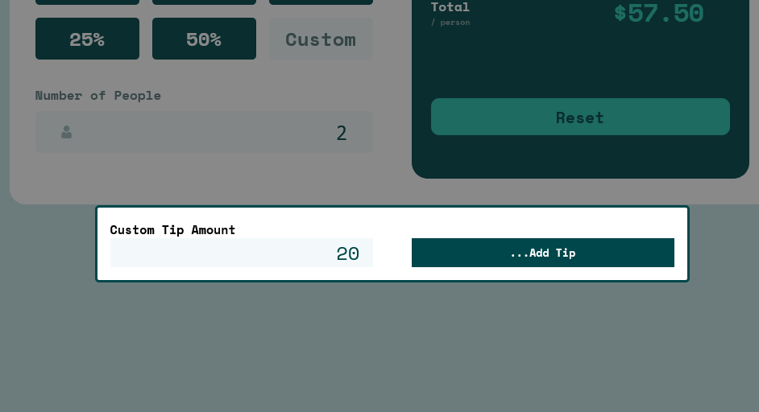

# Frontend Mentor - Tip calculator app solution

This is a solution to the [Tip calculator app challenge on Frontend Mentor](https://www.frontendmentor.io/challenges/tip-calculator-app-ugJNGbJUX). Frontend Mentor challenges help you improve your coding skills by building realistic projects.

## Table of contents

- [Overview](#overview)
  - [The challenge](#the-challenge)
  - [Screenshot](#screenshot)
  - [Links](#links)
- [My process](#my-process)
  - [Built with](#built-with)
  - [What I learned](#what-i-learned)
  - [Continued development](#continued-development)
  - [Useful resources](#useful-resources)
  - [AI Collaboration](#ai-collaboration)
- [Author](#author)

## Overview

### The challenge

Users should be able to:

- View the optimal layout for the app depending on their device's screen size
- See hover states for all interactive elements on the page
- Calculate the correct tip and total cost of the bill per person

### Screenshot

### Links

- Solution URL: [Github](https://github.com/djmills89/TipCalc)
- Live Site URL: [Live Site](https://dm-tip-calc.netlify.app/)

## My process

### Built with

- Semantic HTML5 markup
- CSS custom properties
- Flexbox
- CSS Grid
- Mobile-first workflow

### What I learned

Learned about modals and their native features.  Used the dialog tag to add a modal for the custom tip selection.

### Continued development

Code needs to be refactored.  Need functions for rendering.  Got the project to basically done.

### Useful resources

- [Dialog Element for Modals](https://developer.mozilla.org/en-US/docs/Web/HTML/Reference/Elements/dialog) - Goes over how to use the dialog element.

### AI Collaboration

- ChatGPT
- Used for general guidence and code review.

## Author
- Frontend Mentor - [@danmills89](https://www.frontendmentor.io/profile/djmills89)
